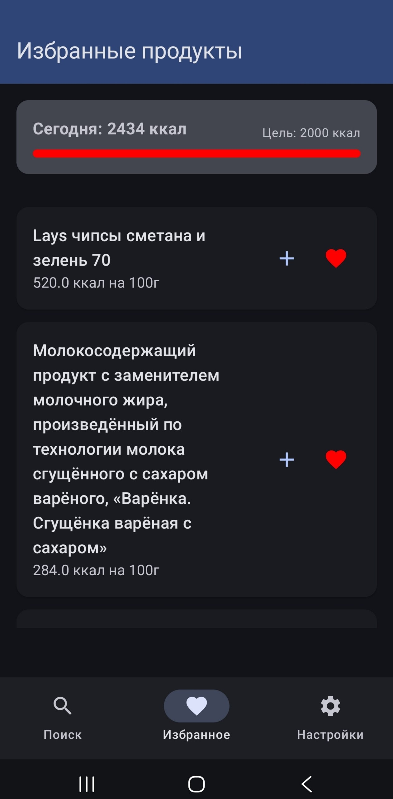
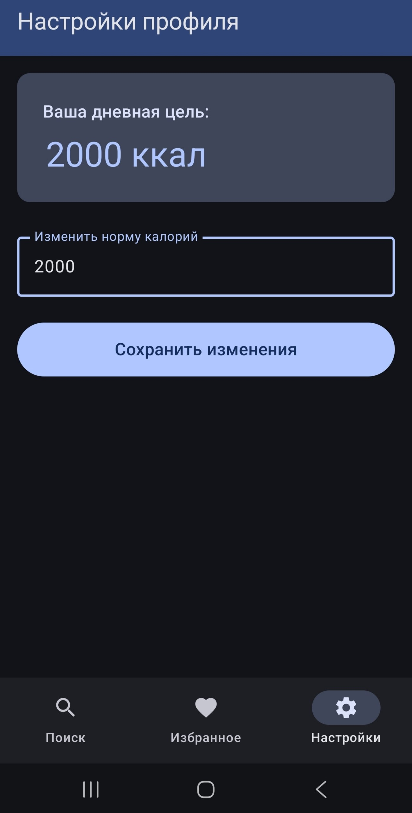
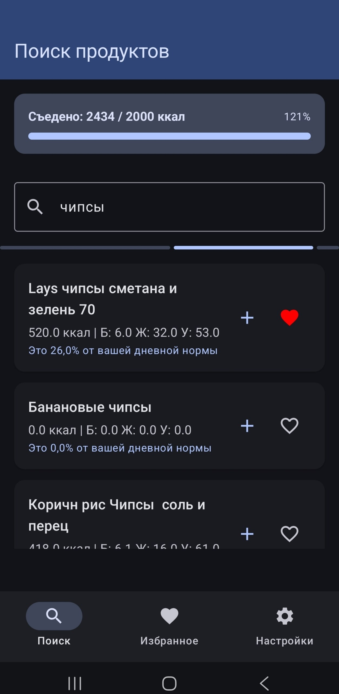
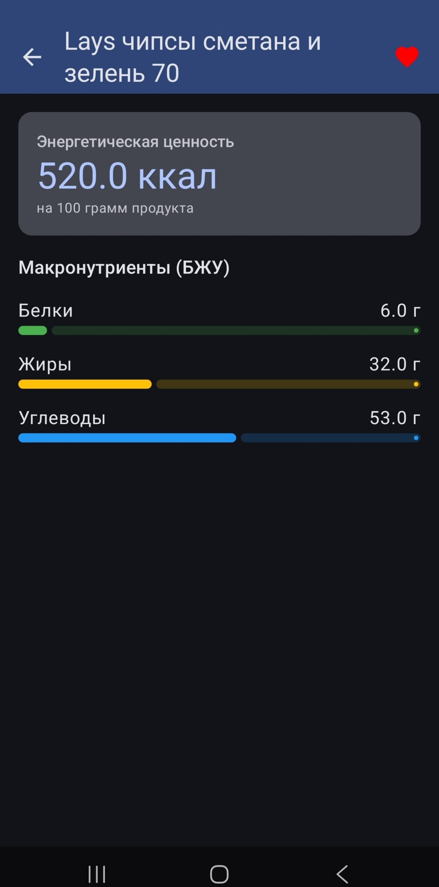

# Nutrition Tracker 🥗

Современное Android-приложение для поиска продуктов питания и отслеживания КБЖУ (калории, белки, жиры, углеводы). Построено по архитектуре MVVM с Offline-First подходом.

---

## Скриншоты

| Поиск | Детали | Избранное | Настройки |
|-------|--------|-----------|-----------|
 
 
 


---

## Функциональность

- **Поиск продуктов** — поиск по базе Open Food Facts через API, результаты кэшируются в Room
- **Offline-first** — при отсутствии сети показываются последние кэшированные данные с информационным сообщением
- **Детальная карточка** — полные данные КБЖУ с визуальными прогресс-барами
- **Избранное** — добавление/удаление из избранного прямо в списке или на экране деталей, отдельный экран избранного
- **Настройки** — сохранение личной дневной нормы калорий через DataStore
- **Состояния UI** — Loading, Success, Error с Retry, Empty

---

## Архитектура

```
MVVM + Repository Pattern + Offline-First

UI (Compose) ←→ ViewModel (StateFlow/UiState/UiEvent)
                    ↓
              Repository
              ↙         ↘
    Room (кэш)      Retrofit (API)
```

### Слои
- **`data/local`** — Room: `FoodEntity`, `FoodDao`, `AppDatabase`
- **`data/remote`** — Retrofit: `FoodApiService`, `FoodDto`
- **`data/repository`** — `FoodRepository` (единая точка доступа)
- **`data/`** — `SettingsDataStore` (DataStore Preferences)
- **`di/`** — Hilt модуль `AppModule`
- **`ui/presentation/screens/`** — 4 экрана: Search, Details, Favorites, Settings
- **`ui/presentation/navigation/`** — `NavGraph`, `Screen`

---

## API: Open Food Facts

- **Base URL:** `https://world.openfoodfacts.org/`
- **Endpoint:** `GET /cgi/search.pl`
- **Параметры:**
  - `action=process` — тип запроса
  - `json=1` — формат ответа
  - `page_size=20` — количество результатов
  - `search_terms={query}` — поисковый запрос
- **Пример:** `https://world.openfoodfacts.org/cgi/search.pl?action=process&json=1&page_size=20&search_terms=apple`
- **Ограничения:** публичный API, без ключа, rate limit ~100 req/min
- **Поля КБЖУ:** `nutriments.energy-kcal_100g`, `nutriments.proteins_100g`, `nutriments.fat_100g`, `nutriments.carbohydrates_100g`

---

## Технический стек

| Технология | Назначение |
|---|---|
| Jetpack Compose | UI |
| Material Design 3 | Дизайн-система |
| MVVM + StateFlow | Архитектура |
| Dagger Hilt | DI |
| Room | Локальная БД / кэш |
| Retrofit + Gson | HTTP-клиент |
| Navigation Compose | Навигация (4 экрана) |
| DataStore Preferences | Хранение настроек |
| Kotlin Coroutines | Асинхронность |

---

## Как запустить

1. Клонируй репозиторий
2. Открой в **Android Studio Hedgehog** или новее
3. Подожди синхронизации Gradle
4. Запусти на эмуляторе или реальном устройстве (Android 7.0+, API 24+)
5. Интернет-соединение нужно только для первого поиска — далее работает офлайн

---

## Экраны навигации

1. **Search** (`SearchScreen`) — поиск продуктов, LazyColumn результатов
2. **Favorites** (`FavoritesScreen`) — список избранных продуктов, LazyColumn
3. **Settings** (`SettingsScreen`) — настройка дневной нормы калорий
4. **Details** (`DetailsScreen`) — детальная карточка продукта с КБЖУ

---

## Ключевые архитектурные решения

- **`OnConflictStrategy.REPLACE`** в DAO — повторные запросы обновляют кэш
- **Nullable id/name в DTO** — защита от краша при некорректных данных API
- **`@Singleton` у Repository** — единый экземпляр, согласованный кэш
- **`@HiltAndroidApp` в Application** — обязательная точка входа Hilt
- **Flow из Room** — UI реактивно обновляется при изменении БД
